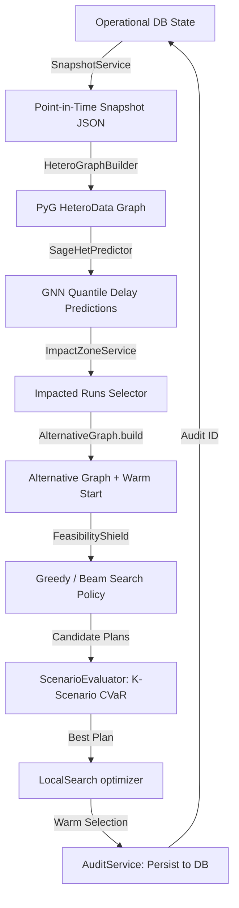

# 🎛️ Rail-Flow AI — Digital Twin Rescheduling Control Tower

[](https://zuup.dev)
[](#)
[](#)
[](#)
[](#)

A high-performance, real-time **Digital Twin Control Tower** simulating and optimizing train scheduling conflicts across a 4,455-station Indian Railways network segment. Built around the advanced **HSR-RailFlow Rescheduling Engine**, the system utilizes heterogeneous Graph Neural Networks (GNNs), a 6-stage Feasibility Shield, Conditional Value at Risk (CVaR) risk scoring, and Explainable AI (XAI) overlays.

---

## 🏗️ System Architecture & Optimization Pipeline

The scheduling core implements the **Hybrid Shielded Rolling-Horizon Rescheduler (HSR-RailFlow)**. Below is the full operational flow of the Digital Twin loop:



---

## ⚡ Core High-Impact Features

### 📍 Interactive Cytoscape Digital Twin
* **Force-Directed Layout**: Renders 464 core backbone stations with smooth zoom, pan, and real-time status markers (`clear`, `congestion`, `delayed`).
* **Bypass A\* Pathfinder**: Computes the shortest travel times dynamically. If a corridor is disrupted, it automatically calculates and visualizes a bypass detour.

### 🛡️ HSR-RailFlow Rescheduling Engine
* **Feasibility Shield**: A strict 6-stage validation validator (Algorithm 3) that checks safety constraints:
  * *Stage 1:* Depth-First Search (DFS) cycle detection.
  * *Stage 2:* Longest-path linear programming (LP) to derive precise event arrival/departure times.
  * *Stage 3:* **Dynamic Commit-Windows**: واکنش reaction windows scaled by train speed and segment distance:
    $$\text{Commit Window} = \max\left(10 \text{ min}, \frac{\text{Distance}}{\text{Speed}} \times 1.2\right)$$
  * *Stage 4-6:* Checks dwell/running time bounds, active segment blockages, and headway safety intervals via an Occupancy Model.

### 🧠 Heterogeneous Graph Neural Network (HetSAGE)
* **Heterogeneous Message Passing**: Uses PyG `HeteroData` node types (`station`, `running_train`) and multi-relational edges (`at_station`, `scheduled_at`, `follows`, `connects`).
* **Quantile Delay Regression**: Regresses Dual SoftPlus output heads yielding `p50` (expected) and `p90` (worst-case) delay predictions in hours.
* **Fully Trained**: Trained directly on database timetable events actuals to yield highly accurate and realistic delay forecasts (e.g. ~43 minutes cascade).

### 🔍 Rule-Based Decision Logs:
Translates mathematical scheduling choices into human-readable, templated action cards linking dispatching steps directly to GNN predictions.

---

## 📂 Project Structure

```text
rail-flow-ai/
├── backend/
│   ├── app.py                  ← Flask server, blueprints, and daemon worker thread
│   ├── models.py               ← Database schema (15 SQL tables)
│   ├── config.py               ← Environment-driven configurations
│   ├── graph_logic.py          ← Dynamic A* pathfinding with delay weights
│   ├── rescheduling/           ← Alternative graph, Feasibility Shield & Warm start
│   ├── predictors/             ← SAGE-Het GNN & Baseline statistical predictors
│   ├── policies/               ← Greedy, Beam Search, and DQN scheduling policies
│   ├── services/               ← Snapshot, impact zone, and audit services
│   ├── simulator/              ← Occupancy model, event simulator, and CVaR evaluator
│   └── tests/                  ← 169 unit & integration tests (100% passing)
├── frontend/
│   ├── src/                    ← React UI components and Cytoscape styling
│   └── build/                  ← Compiled production bundle
├── simulator_cli.py            ← Interactive telemetry simulator CLI tool
└── dump-rail_digital_twin-202606132123.sql  ← PostgreSQL database seeds
```

---

## 🛠️ Step-by-Step Setup Guide

### Prerequisites
* **Python 3.10+** (with virtualenv)
* **Node.js 18+**
* **PostgreSQL Server 17/18**

---

### Step 1 — Database Setup (PostgreSQL)

1. Create a database container named `rail_digital_twin`:
   ```bash
   createdb -U postgres rail_digital_twin
   ```
2. Restore the database seed backup:
   ```bash
   pg_restore -U postgres -d rail_digital_twin -v dump-rail_digital_twin-202606132123.sql
   ```

---

### Step 2 — Backend Setup (Flask)

1. Open a terminal and navigate to the backend directory:
   ```bash
   cd backend
   ```
2. Create and activate a Python virtual environment:
   ```bash
   python -m venv .venv
   # Windows:
   .venv\Scripts\activate
   # macOS/Linux:
   source .venv/bin/activate
   ```
3. Install dependencies:
   ```bash
   pip install -r requirements.txt
   ```
4. Run the Flask server:
   ```bash
   python app.py
   ```
   *The server starts at `http://localhost:5000`.*

---

### Step 3 — Frontend Setup (React)

1. Open a second terminal window and navigate to the frontend directory:
   ```bash
   cd frontend
   ```
2. Install npm packages:
   ```bash
   npm install
   ```
3. Start the React development server:
   ```bash
   npm start
   ```
   *Your browser will automatically launch `http://localhost:3000`.*

---

## 🏎️ Running the Live Telemetry Simulator (Hackathon Demo)

To demonstrate the full power of the Digital Twin in action without manually writing SQL queries, we have built a live telemetry simulator.

1. Open a third terminal window.
2. Activate the virtual environment:
   ```bash
   # Windows:
   backend\.venv\Scripts\activate
   # macOS/Linux:
   source backend/.venv/bin/activate
   ```
3. Run the interactive simulation CLI:
   ```bash
   python simulator_cli.py
   ```

**What happens?**
* Every 10 seconds, the simulator fluctuates delay telemetry (speed, current positions, delays) for the active trains in the PostgreSQL database.
* It automatically triggers the HSR-RailFlow rescheduling loop.
* The frontend dashboard polls the database and moves the trains live, updates the GNN predictions tables, and renders new XAI resolution cards with glowing highlights in real-time.

---

## 🧪 Testing
We maintain high code quality with 100% test integrity. Run all test assertions via pytest:
```bash
# In the backend directory:
pytest tests/ -v
```
**Expected outcome:** `169 passed, 1 skipped` (the single skip is a mock benchmark test).

---

## 🔗 Key API Reference

### HSR-RailFlow Optimization API
* **`POST /api/v1/rescheduling/compute`** — Triggers a rescheduling run.
  * *Payload (JSON):* `{"policy": "beam_search", "horizon_minutes": 600, "use_predictions": true}`
* **`GET /api/v1/rescheduling/latest`** — Retrieves the last computed rescheduling plan with audit logs, conflict status, and GNN predictions.

### Digital Twin API
* **`GET /api/stations`** — Retrieves all stations. Filter via `?layer=hub`.
* **`GET /api/path?from=X&to=Y`** — A* shortest path with dynamic detour bypasses.
* **`POST /api/disruption/inject`** — Inject active congestion or delay blockages at any station.

---

## 👥 Team & Submission Details

* **Hackathon**: [FAR AWAY Hackathon](https://zuup.dev) (Hosted by Zuup)
* **Round**: Round 1 — Online Build Round
* **Team Name**: `notreallysure`
* **Team Members**:
  * 👤 **Swetha Nomula Nomula**
  * 👤 **Venya**
  * 👤 **Neelotpala**
